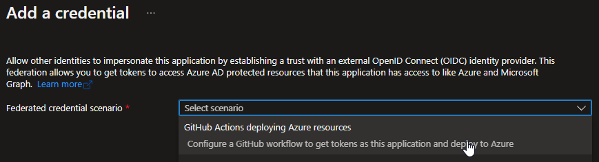
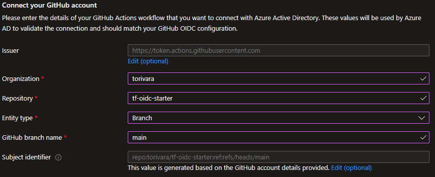
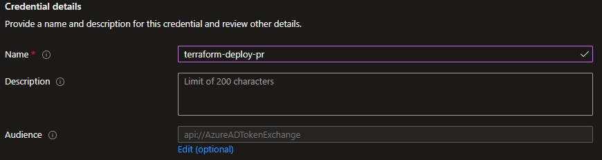
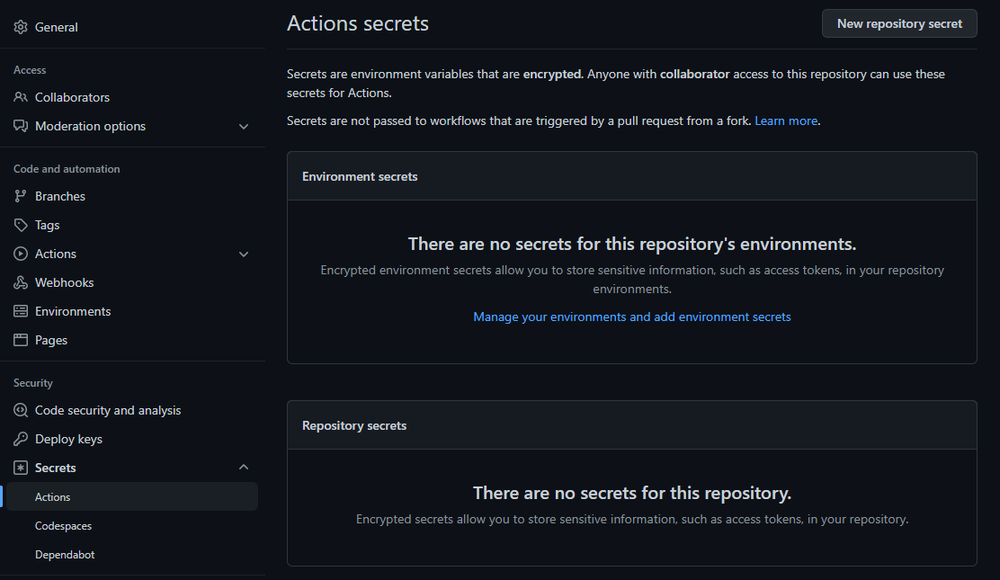

# Terraform OpenID Connect to Azure

Repository for starting out with Terraform to Azure with OpenID Connect authentication

## Prereqs OIDC

- Create an Azure AD App Registration.
- Add federated credentials for the Azure Active Directory application.
- Create GitHub secrets for storing Azure configuration.

### Create Azure AD App Registration

```pwsh
$context = get-azcontext
$subscriptionId = $context.subscription.id
$appId = (az ad app create --display-name myApp | convertFrom-json).appId
$objectId = (az ad sp create --id $appId | convertfrom-json).objectId
az role assignment create --role contributor --subscription $subscriptionId --assignee-object-id  $objectId --assignee-principal-type ServicePrincipal --scope /subscriptions/$subscriptionId/resourceGroups/$resourceGroupName

Write-Host "These are the "secrets" you need to add to GitHub`n-----------------------------------------------`nApplication Id (ClientId/AppId/AAD_APP_ID): $appId`nTenant Id (Directory Id/AAD_TENANT_ID): $($context.tenant.id)`nSubscription Id (AZURE_SUBSCRIPTION_ID): $subscriptionId`n-----------------------------------------------"
```

### Add federated credentials

Follow [this guide](https://docs.microsoft.com/en-us/azure/developer/github/connect-from-azure?tabs=azure-portal%2Cwindows#add-federated-credentials) from Microsoft for updated guidance.

Some specific info and tips:

Choose `GitHub Actions deploying Azure resources`



Added credential for user `torivara`:



*Could be organization also, but for this demo it is only my personal user.*

Add configuration for `main` branch of `tf-oidc-starter` repository:


*Replace these with values from you own, though main branch might be the same, repository name is probably not.*

Authentication from a Pull Request did not work with this setting only, so I needed to add Pull Request entity type also:



### Create GitHub secrets



- AAD_APP_ID – Will be the app id/client id from above
- AAD_TENANT_ID – The Azure AD tenant Id from above
- AZURE_SUBSCRIPTION_ID – Subscription Id from above

## Prereqs Terraform

- Create Resource Group
- Create Storage Account
- Create Storage Account Container
- Add service principal as blob data contributor

```pwsh
$randomNumber=(Get-Random -Maximum 10000)
$appName='terraform-oidc-test-app'
$resourceGroupName="tia-testingterraform$randomNumber-rg"
$subscriptionId=(Get-AzContext).Subscription.Id
$location='westeurope'
$storageAccountName="testingterraform$randomNumber"
$appId=(az ad sp list --display-name $appName --query '[].appId' -o tsv)
az group create -n $resourceGroupName -l $location
az storage account create -n $storageAccountName -g $resourceGroupName -l $location --sku Standard_LRS
az storage container create -n terraformstate --account-name $storageAccountName
az role assignment create --role 'Storage Blob Data Contributor' --assignee-object-id  "$appId" --assignee-principal-type ServicePrincipal --scope "/subscriptions/$subscriptionId/resourceGroups/$resourceGroupName/providers/Microsoft.Storage/storageAccounts/$storageAccountName"

Write-Host "These are the terraform settings you need to update in main.tf`n--------------------------------------------------------------`nresource_group_name = `"$resourceGroupName`"`nstorage_account_name = `"$storageAccountName`"`ncontainer_name = `"terraformstate`"`nkey = `"terraformstate.tfstate`""
```

Waiting for [Terraform v1.2.0](https://github.com/hashicorp/terraform-provider-azurerm/pull/16555)...
