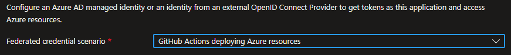
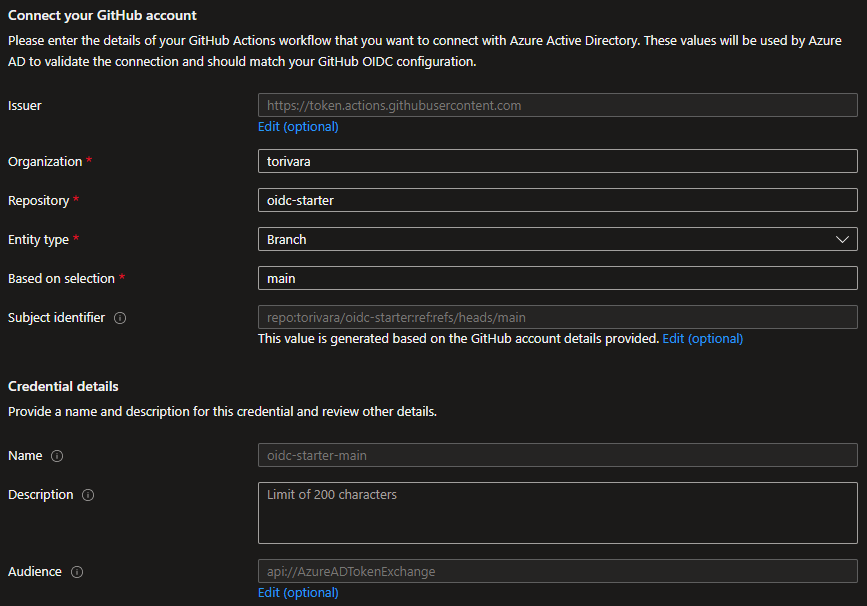
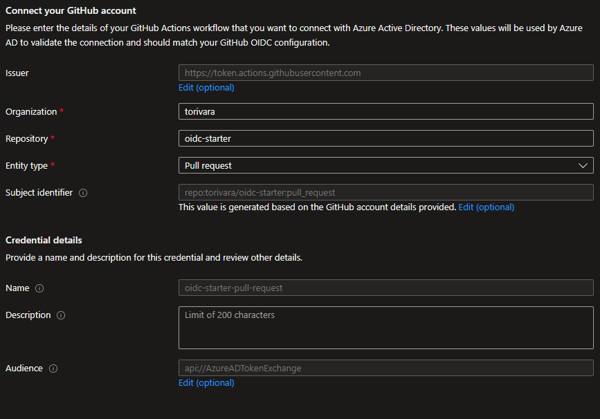

# OpenID Connect to Azure

[](https://github.com/pre-commit/pre-commit)

Repository for starting out with OpenId Connect to Azure from GitHub Actions.

## Prereqs OIDC

- Create an Azure AD App Registration.
- Add federated credentials for the Azure Active Directory application.
- Create GitHub secrets for storing Azure configuration.

### Create Azure AD App Registration

```pwsh
$context = get-azcontext
$subscriptionId = $context.subscription.id
$appId = (az ad app create --display-name oidc-demo | convertFrom-json).appId
$objectId = (az ad sp create --id $appId | convertfrom-json).objectId
az role assignment create --role contributor --subscription $subscriptionId --assignee-object-id  $objectId --assignee-principal-type ServicePrincipal --scope /subscriptions/$subscriptionId

Write-Host "These are the `"secrets`" you need to add to GitHub`n-----------------------------------------------`nApplication Id (ClientId/AppId/AAD_APP_ID): $appId`nTenant Id (Directory Id/AAD_TENANT_ID): $($context.tenant.id)`nSubscription Id (AZURE_SUBSCRIPTION_ID): $subscriptionId`n-----------------------------------------------"
```

### Add federated credentials

Follow [this guide](https://docs.microsoft.com/en-us/azure/developer/github/connect-from-azure?tabs=azure-portal%2Cwindows#add-federated-credentials) from Microsoft for updated guidance.

Some specific info and tips:

Choose `GitHub Actions deploying Azure resources`



Added credential for `main` branch of repo `oidc-starter` in user/org `torivara` repository:



*Could be organization also, but for this demo it is only my personal user.*
*Replace these with values from you own, though main branch might be the same, repository name is probably not.*

Authentication from a Pull Request did not work with this setting only, so I needed to add Pull Request entity type also:



### Create GitHub secrets


- AAD_APP_ID – Will be the app id/client id from above
- AAD_TENANT_ID – The Azure AD tenant Id from above
- AZURE_SUBSCRIPTION_ID – Subscription Id from above

